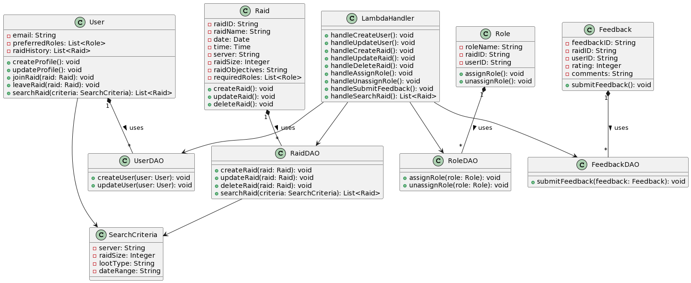
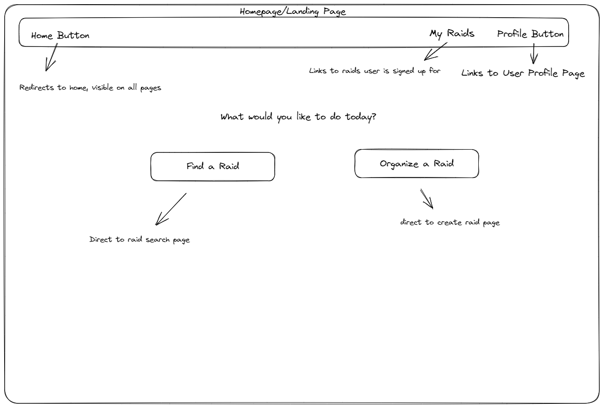
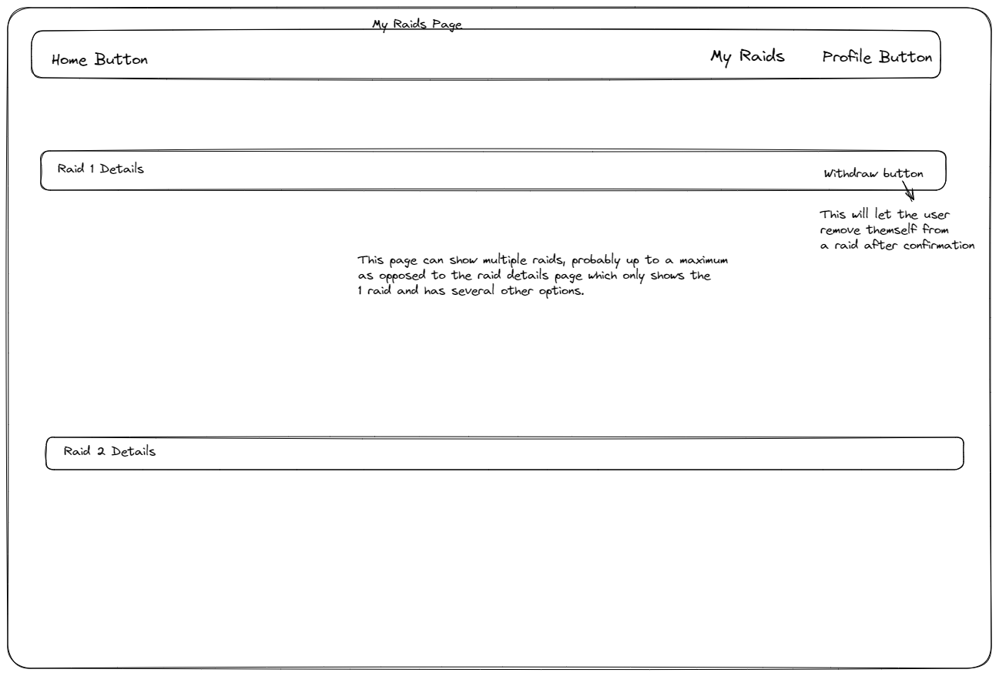
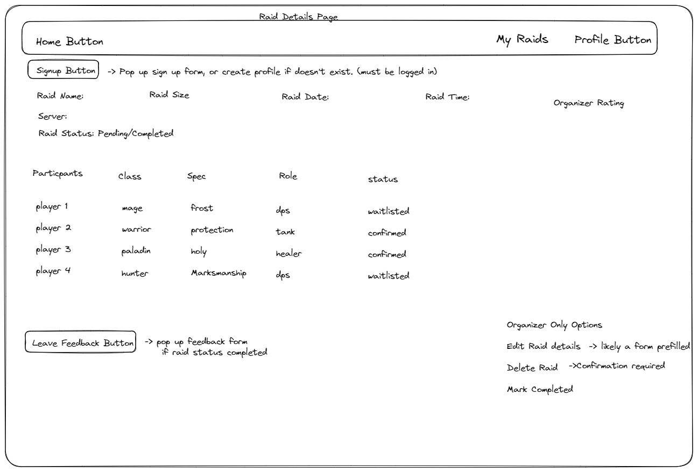
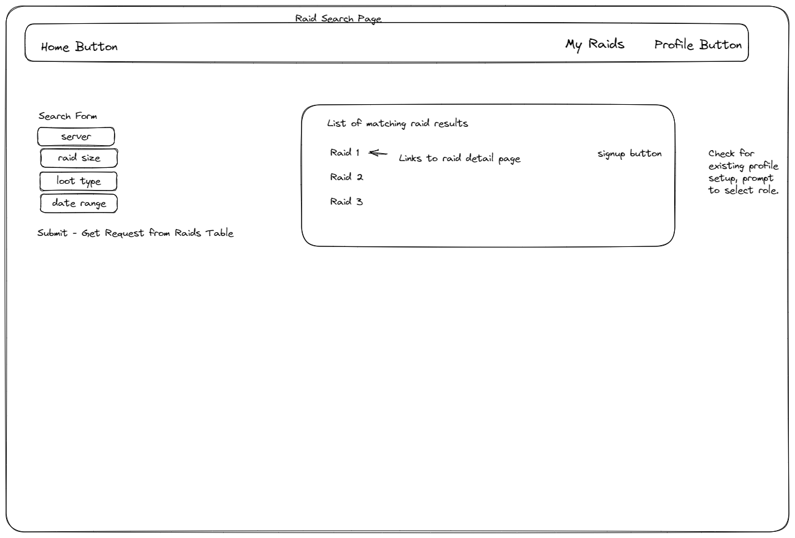
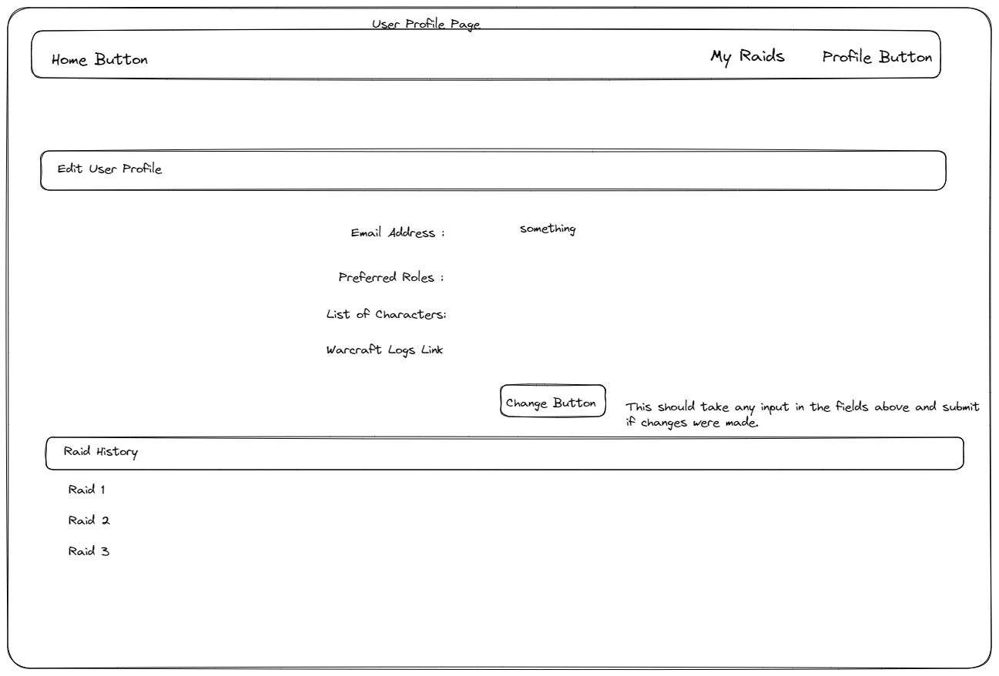

Project Title Design
## 1. Problem Statement

Create a platform specifically for World of Warcraft Classic players to schedule and join raids hosted by other 
 users. The platform will serve as a centralized system for players to coordinate and participate in raiding activities within the game.

  For context a raid is a specialized type of gameplay activity involving a large group of players working together to overcome challenging content, typically in a cooperative or competitive setting. Raids are often designed to be more difficult and complex than regular gameplay encounters, requiring coordination, teamwork, and strategic planning.

   

## 2. Top Questions to Resolve in Review

API Integration : Can we leverage any existing World of Warcraft API's to pull data?

UI-Design :  How can we make this intuitive and user-friendly for both new and experienced players?  How do we want 
to display raids, profiles, etc.

What kind of systems might we need to handle inappropriate behavior?  Example might be not attending a raid you were 
committed to,  an organizer not running the raid to standards, raiders being toxic to other community members during 
a raid, etc.

How can we design the platform to handle an increasing number of raids and users without affecting performance?

What features can we offer that would make users want to use our platform as opposed to another form of organization?

## 3. Use Cases


U1. As a user on the platform, I want to setup a profile with my game details and raid preferences 
so that I can be matched with appropriate raids.

U2. As a user, I want to be able to create a new raid event when I log into the platform so that others 
may sign up for my raids.

U3. As a user, I want to be able to update event details, so that I can communicate changes or important 
information to participants.

U4. As a user I want to be able to search for raids based on specific criteria when I log into the 
platform so I can find raids that fit my availability and in-game goals.

U5. As a user I want to be able to sign up for specific roles in game, so that I am joining raids that 
fit my preferred role.

U6. As a user, I want to provide feedback after a specific raid, so that players can gauge the quality 
of the raid the and leader's performance.

U7. As a developer I want to ensure the platform is secure and privacy-respecting, such that user feel comfortable 
providing feedback in an anonymous capacity as to not be harmed by the community.

U8. As a user, I want to be able to see the type of loot distribution the raid will use(GDKP or Open roll),
so that I can 
sign up for the type of raids I desire.

U9. As a user I want to be able to delete a raid so that I can cancel a raid for unforeseen circumstances.

U10. As a user, I want to be able to review the queue of players who have signed up for my raid, and approve or reject their participation based on their profiles and needs of the raid so I can create a balanced composition.

U11. As a user, I want to be able to remove myself from a raid sign up queue so that I can communicate that I won't be able to attend a raid.


## 4. Project Scope

4.1. In Scope
Which parts of the problem defined in Sections 1 and 2 will you solve with this design? This should include the base functionality of your product. What pieces are required for your product to work?

User Registration and CreateProfile Management:  Users will be able to create and manage their profiles, including game 
details and raid preferences.

Raid Creation and Management: Raid organizers will be able to create and manage raid events.  This will includes 
details name, date, time, server, raid size, raid objectives(Farm or progression), required roles.

Raid Search and Sign up :  Players will be able to search for raids based on criteria such as server, raid size, or 
loot distribution.  They can view raid details, available slots, and sign up to join raids.

Role Sign-Up:  Within a raid event, users can sign up for specific roles (i.e, tank, healer, dps).

Player approval:  Raid organizers can review the queue of players who have signed up for the raid and approve or 
reject based on the needs of the raid.

Raid Feedback: Users should be able to provide rating after completing a raid that will contribute to the organizers 
overall rating(i.e. scale of 1 to 5)

The functionality described above should be what your design is focused on. You do not need to include the design for any out of scope features or expansions.

## 4.2. Out of Scope


Raid Notification and Reminders:  Automated notifications such as rad details, starting times, changes to the raid, 
or roster approval would help.  This could be complex and would not have time so currently out of scope.

Chat platform: Would like to provide a platform for raiders to discuss strategies, coordinate logistics, and 
communicate with other members before a raid.   This is out of scope.

In-Depth player statistics:  This would be such as have historical performance metrics and also individual player 
ratings from either other users or the organizer.  This would require some additional moderation that our time 
constraints will not allow for.

Social Features:  Details such as friends list, private messaging would be nice to have but are out of scope.  Our 
focus currently is facilitating raid scheduling and coordination.

Feedback:  Player feedback on the platform for future enhancements would be ideal, but is currently out of scope.


The functionality here does not need to be accounted for in your design.

## 5. Proposed Architecture Overview

Database: DynamoDB database will be used to store user data, raid data, and other necessary information

Frontend: Frontend will be developed as a web-based interface, we will use webpack for the majority of this and use 
HTML, CSS, and Javascript languages.  This will communicate with the backend using RESTful APIs

Backend : Lambda Functions will handle operations for user registration, raid creating, raid search, role sign-up , 
feedback, etc.  Each Lambda will be designed to handle a specific task.

Activity/Requests/Results Builder Pattern: This is the standard pattern we've been following, which will help with 
the interaction between different components.

DynamoDBMapper:  We will use DynamoDBMapper to map client side classes to our DynamoDB tables , for storing and 
retrieving data.

POJOs:  These will represent our data entities, such as Raids, Users, Profiles.

DAO's:  We will use DAO's to encapsulate all direction interactions with our database. This design will allow us to 
be flexible with future changes.

This design pattern will allow us to create a modular application for future changes, and well as scalability.  This 
should satisfy all the required design of the project.  Each component will handle a specific part of the system, 
this should make it easier to manage, test, and extend as needed.



## 6. API

6.0.1 Public Models
```

// UserModel

String userId;
String displayName;
String email;
String class;
List<String> preferredRoles;
String logs;
```

```

//RaidModel

String raidId;
String raidName;
Date raidDate;
String time;
String server;
String raidSize;
String raidObjectives;
Map<String, Integer> requiredRoles;
List<ParticpantModel> participants;
List<FeedbackModel> feedback;
String raidOwner;
```

```

//ParticipantModel

String userId;
String role;
Boolean confirmed;
```

```

//FeedbackModel

String userId;
Integer rating;
String comments;
```

6.1. User CreateProfile Endpoint
* Accepts `POST` requests to `/users`
* Accepts a User model and creates a new user profile.
* If the user profile cannot be created, will throw a `UserProfileCreationException`.

6.2. User UpdateProfile Endpoint
* Accepts `PUT` requests to `/users/:userId`
* Accepts a userId and User model with updated information and updates the user's profile.
* If the user profile is not found, will throw a `UserProfileNotFoundException`.

6.3. Raid Event Creation Endpoint
* Accepts `POST` requests to `/raidevents`
* Accepts a RaidEvent model and creates a new raid event.
* If the raid event cannot be created, will throw a `RaidEventCreationException`.

6.4. Raid Event Update Endpoint
* Accepts `PUT` requests to `/raidevents/:raidId`
* Accepts a raidId and RaidEvent model with updated information and updates the raid event.
* If the raid event is not found, will throw a `RaidEventNotFoundException`.

6.5. Raid Event Deletion Endpoint
* Accepts `DELETE` requests to `/raidevents/:raidId`
* Accepts a raidId and deletes the raid event.
* If the raid event is not found, will throw a `RaidEventNotFoundException`.

6.6. Get Raid Event Endpoint
* Accepts `GET` requests to `/raidevents/:raidId`
* Accepts a raidId and returns the corresponding RaidEvent model.
* If the given raid ID is not found, will throw a `RaidEventNotFoundException`.

6.7. Raid Search Endpoint
* Accepts `POST` requests to `/raidevents/search`
* Accepts SearchCriteria model and returns a list of RaidEvent models that match the criteria.

6.8. Raid Sign Up Endpoint
* Accepts `POST` requests to `/raidevents/:raidId/signup`
* Accepts a raidId and User model and signs the user up for the raid.
* If the raid ID or user ID is not found, or if the user cannot be signed up, will throw a `RaidSignupException`.

6.9. Raid Sign Off Endpoint
* Accepts `DELETE` requests to `/raidevents/:raidId/signup/:userId`
* Accepts a raidId and userId and removes the user from the raid's sign up list.
* If the raid ID, user ID, or signup is not found, will throw a `RaidSignupNotFoundException`.

6.10. Role Assignment Endpoint
* Accepts `POST` requests to `/raidevents/:raidId/roleassignments`
* Accepts a raidId, userId, and Role model and assigns the role to the user in the raid.
* If the role assignment cannot be made, will throw a `RoleAssignmentException`.

6.11. Role Removal Endpoint
* Accepts `DELETE` requests to `/raidevents/:raidId/roleassignments/:userId`
* Accepts a raidId and a userId and removes the user's role assignment in the raid.
* If the role assignment is not found, will throw a `RoleAssignmentNotFoundException`.

6.12. Submit Feedback Endpoint
* Accepts `POST` requests to `/raidevents/:raidId/feedbacks`
* Accepts a raidId and Feedback model and submits the feedback for the raid.
* If the feedback cannot be submitted, will throw a `FeedbackSubmissionException`.

6.13. Get Raid Feedback Endpoint
* Accepts `GET` requests to `/raidevents/:raidId/feedbacks`
* Accepts a raidId and returns a list of Feedback models for the raid.
* If the raid ID is not found, will throw a `RaidEventNotFoundException`.

6.14. User GetProfile Endpoint
* Accepts `GET` requests to `/users/:userId`
* Accepts a userId and returns the corresponding User model.
* If the given user ID is not found, will throw a `UserProfileNotFoundException`.

6.15. Get Raid History Endpoint
* Accepts `GET` requests to `/users/:userId/raids`
* Accepts a userId and returns a list of RaidEvent models the user has signed up for.
* If the user ID is not found, will throw a `UserProfileNotFoundException`.

## 7.0  Tables


**Users Table: (This will contain profile information, class, role, logs link, etc)** <p>
• userId (Partition key): String

Attributes : email, class, preferredRoles, logs

**Raids Table:  Query raids based on the date.**

• raidId (Partition key): String<p>
• Date (GSI): Number

Attributes : raidName, date, time, server, raidSize, requiredRoles, participants, raidObjective, List - ,
Feedback (userId, rating, comments)  ,  raidOwner


**UserRaidsTable : This table allows us to fetch all raids a user has signed up for, and all users that have signed up for a particular raid.**

• userId (Partition Key): String  <p>
• raidId (Sort Key): String

Attributes : role, confirmed.


## 8.0 Pages







